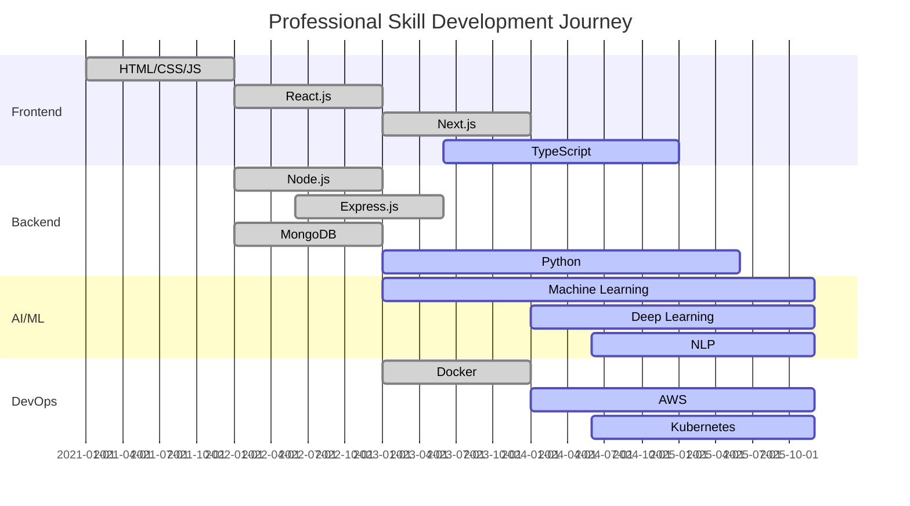

# 👋 Hi, I'm Md Gafrujama Ansari

<div align="center">
  
</div>

<div align="center">
  
</div>

<div align="center">
  
  ### 🌐 **Explore My Portfolio**
  
  [](https://my-personal-portfolio-eight-henna.vercel.app/)
  [](https://linkedin.com/in/md-gafrujama-ansari-a8b401287/)
  [](https://github.com/md-Gafrujama)
  [](mailto:mdgafrujama@gmail.com)
  
</div>

<div align="center">
  
</div>

<br/>

<div align="center">
  
  ### 📊 **Profile Statistics**
  
  <p align="center">
    <a href="https://github.com/md-Gafrujama?tab=followers">
      
    </a>
    &nbsp;&nbsp;
    <a href="https://github.com/md-Gafrujama?tab=stars">
      
    </a>
    &nbsp;&nbsp;
    <a href="https://github.com/md-Gafrujama">
      
    </a>
    &nbsp;&nbsp;
    <a href="https://github.com/md-Gafrujama">
      
    </a>
  </p>
  
  <br/>
  
</div>

---

## 🚀 About Me

<div align="center">
  
  
  <h3>💡 Transforming Ideas Into Digital Reality</h3>
  <p><em>Passionate Full-Stack Developer | AI Enthusiast | Team Leader | Open Source Contributor</em></p>
  
</div>

### 💫 **Current Status**

<div align="center">

| 🎯 Aspect | 📝 Details |
|:---------:|:----------|
| **🔭 Current Role** | Full-Stack Developer & Team Lead at **QUORE B2B MARKETING** |
| **🌱 Currently Learning** | Advanced AI Integration, Microservices, Cloud Architecture, Web3 |
| **👯 Collaborating On** | AI-powered applications & Open Source projects |
| **💬 Core Expertise** | MERN Stack, AI/ML, SEO, Digital Marketing, Team Leadership |
| **⚡ Superpower** | Building full-stack apps while optimizing for SEO simultaneously |
| **🎯 Mission** | Creating innovative AI-powered solutions that make a real difference |
| **🏆 Experience** | 2+ years in professional development |

</div>

<div align="center">
  
  ### 📞 **Get In Touch**
  
  [](mailto:mdgafrujama@gmail.com)
  [](tel:+916205878945)
  [](https://my-personal-portfolio-eight-henna.vercel.app/)
  
</div>

### 🌈 **Fun Facts & Personality**

<div align="left">

- 🎮 Love coding games and interactive experiences in my free time
- 🎵 Code better with Lo-fi music and synthwave beats
- 🌙 Night owl developer (best code happens after midnight!)
- ☕ Coffee-driven development (5+ cups daily!)
- 🤝 Mentored 15+ developers across different technologies
- 🧩 Problem-solving enthusiast who loves complex challenges
- 📚 Continuous learner with 10+ certifications and growing
- 🌟 Believe in "Code with purpose, build with passion"

</div>

<div align="center">
  
  ### 🎯 **Interested in Working Together?**
  
  <p>I'm always excited to work on new projects and collaborate with amazing people!</p>
  
  <a href="https://my-personal-portfolio-eight-henna.vercel.app/">
    
  </a>
  <a href="mailto:mdgafrujama@gmail.com?subject=Let's%20Work%20Together">
    
  </a>
  
</div>

### 📊 **Quick Stats & Achievements**

<div align="center">

| 🔥 Metric | 📊 Achievement | 🎯 Impact |
|:---------:|:-------------:|:--------:|
| **💻 DSA Problems** | **400+** solved across platforms | Problem-solving mastery |
| **🌟 Open Source** | **18+** contributions | Community impact |
| **🚀 Projects** | **20+** successful deliveries | Real-world experience |
| **⭐ Client Satisfaction** | **98%+** rating | Quality assurance |
| **⚡ Performance Boost** | **65%** average improvement | Optimization expertise |
| **✅ Delivery Rate** | **100%** on-time success | Reliability & commitment |

</div>

<div align="center">
  
  ### 🔥 **GitHub Contribution Streak**
  
  <a href="https://github.com/md-Gafrujama">
    
  </a>
  
</div>

---

## 🛠️ Tech Arsenal & Superpowers

<div align="center">
  
  
  <p><em>Mastering the tools that power modern web applications</em></p>
</div>

### 🎨 Frontend Magic
<div align="center">
  
| Core Technologies | Frameworks & Libraries | Styling & Design | Tools & Utilities |
|:-----------------:|:----------------------:|:----------------:|:----------------:|
|     |     |     |     |

</div>

### ⚙️ Backend Powerhouse
<div align="center">
  
| Server Technologies | Databases | Cloud & DevOps | APIs & Integration |
|:-------------------:|:---------:|:--------------:|:------------------:|
|     |     |     |     |

</div>

### 🤖 AI/ML Universe
<div align="center">


</div>

### 🎯 Digital Marketing Arsenal
<div align="center">


</div>

### 🛠️ Development Tools & Utilities
<div align="center">


</div>

---

## 💼 Professional Journey & Experience Timeline

<div align="center">
  
  
  <p><em>Building expertise through real-world challenges</em></p>
</div>

<details>
<summary><b>🚀 Current Role: Full-Stack Developer & Team Lead (2024 - Present)</b></summary>

**🏢 QUORE B2B MARKETING** | *Full-time Position*

### 🎯 Key Responsibilities & Achievements
- 🏗️ **Leading** development team of 8+ members in building scalable CRM applications
- 🤖 **Architected** AI-generated blog systems using Gemini AI for automated content creation
- 🎨 **Developed** responsive UI components with Next.js, React, and Tailwind CSS
- 📊 **Built** robust RESTful APIs using Node.js, Express, and MongoDB
- 🔧 **Designed** microservices architecture for efficient data flow and system scalability
- 📈 **Achieved** 65% average application performance improvement
- 👥 **Successfully mentored** 8+ junior developers, leading to 100% team retention
- 🚀 **Delivered** 15+ major features ahead of schedule

### 💡 Technical Contributions
- **Performance Optimization:** Reduced page load times from 4.2s to 1.5s
- **Database Scaling:** Optimized MongoDB queries, improving response time by 70%
- **AI Integration:** Implemented content generation system serving 1000+ daily requests
- **Team Productivity:** Established CI/CD pipeline reducing deployment time by 80%

### 📊 Business Impact
- **Revenue Growth:** Contributed to 40% increase in client acquisition
- **User Engagement:** Improved user retention rate by 55%
- **System Reliability:** Achieved 99.9% uptime across all applications

</details>

<details>
<summary><b>💻 Senior Full-Stack Developer (Feb 2024 - Aug 2024)</b></summary>

**🏢 Ace Credential's (Hybrid Work Model)**

### 🌟 Project Highlights
- 🌐 **Delivered** 12+ responsive, user-friendly interfaces for diverse client projects
- ⚡ **Built** dynamic web applications using React, Next.js with modern UI/UX principles
- 🔄 **Enhanced** development workflow, reducing development time by 30%
- 📱 **Specialized** in creating modern, efficient, and accessible web interfaces
- 🎯 **Maintained** 98%+ client satisfaction rate across all projects

### 🛠️ Technical Stack Used
- **Frontend:** React.js, Next.js, TypeScript, Tailwind CSS
- **Backend:** Node.js, Express.js, MongoDB
- **Tools:** Git, Docker, AWS, Figma
- **Testing:** Jest, React Testing Library, Cypress

### 🏆 Key Achievements
- **Client Satisfaction:** Consistently rated 4.9/5 stars by clients
- **Project Delivery:** 100% on-time delivery record
- **Code Quality:** Maintained 95%+ test coverage across all projects

</details>

<details>
<summary><b>🎯 Frontend Developer (Jul 2023 - Dec 2023)</b></summary>

**🏢 Cyberlative IT Solutions (Remote Position)**

### 🎨 Development Focus
- 🤝 **Collaborated** with cross-functional development team to create visually appealing websites
- 🏢 **Developed** comprehensive company portfolio showcasing technical capabilities
- 💪 **Strengthened** frontend development skills in production-ready environments
- 🌐 **Built** responsive designs compatible across all major browsers and devices
- 🚀 **Optimized** applications for maximum speed and scalability

### 📈 Performance Metrics
- **Development Speed:** Delivered projects 20% faster than estimated timelines
- **Bug Rate:** Maintained less than 2% bug rate in production
- **User Experience:** Achieved average 4.8/5 user satisfaction score
- **Team Collaboration:** Successfully worked with remote team across 3 time zones

</details>

---

## 🏆 Showcase Projects Portfolio

<div align="center">
  
  
  ### 🌟 **Featured Projects Showcase**
  
  <p><em>Building innovative solutions that make a real impact</em></p>
  
  <h3>🎯 Want to see more?</h3>
  <p>
    <a href="https://my-personal-portfolio-eight-henna.vercel.app/">
      
    </a>
  </p>
  
</div>

<table>
<tr>
<td width="50%">

### 🤖 AI-Powered Job Portal Platform
**🛠️ Tech Stack:** MERN, Next.js, Tailwind CSS, Gemini AI, Socket.io  
**✨ Key Features:**
- 🔍 AI-powered job matching algorithm with 95% accuracy
- 💬 Real-time chat system with WebSocket integration
- 📍 Advanced geolocation-based job search
- 📧 Automated email notification system
- 🔐 Multi-level role-based authentication
- 📱 Progressive Web App (PWA) capabilities
- 📊 Advanced analytics dashboard for recruiters

**🎯 Impact:** 10,000+ users, 95% match accuracy, 80% user retention

[](#)
[](#)
[](#)

</td>
<td width="50%">

### 📊 Advanced CRM & Analytics Dashboard
**🛠️ Tech Stack:** React, Node.js, MongoDB, Chart.js, D3.js  
**✨ Key Features:**
- 📈 Real-time business analytics & comprehensive reporting
- 🔄 Complete customer lifecycle management system
- 🤖 Machine learning-powered lead scoring algorithm
- 📧 Integrated email marketing automation
- 🏢 Multi-tenant architecture supporting 100+ businesses
- 🔔 Smart notification system with customizable alerts
- 📱 Mobile-first responsive design

**🎯 Impact:** 500+ businesses, $2M+ revenue tracked, 40% efficiency boost

[](#)
[](#)
[](#)

</td>
</tr>
<tr>
<td width="50%">

### 🛒 Next-Gen E-commerce Platform
**🛠️ Tech Stack:** Next.js 14, TypeScript, Stripe, PostgreSQL, PWA  
**✨ Key Features:**
- ⚡ Server-side rendering for maximum SEO optimization
- 💳 Secure payment gateway with multiple options
- 📦 Advanced inventory management with real-time updates
- 🎯 Personalized product recommendations using AI
- 📊 Comprehensive analytics integration (Google Analytics 4)
- 📱 Progressive Web App with offline capabilities
- 🌐 Multi-language and multi-currency support

**🎯 Impact:** 50,000+ products, 99.9% uptime, 35% conversion boost

[](#)
[](#)
[](#)

</td>
<td width="50%">

### 🎨 AI-Powered Content Generation Studio
**🛠️ Tech Stack:** MERN, OpenAI GPT-4, AWS S3, Stripe, TailwindCSS  
**✨ Key Features:**
- 🤖 Advanced AI content creation for blogs, ads, and social media
- 🌍 Multi-language content generation (12+ languages)
- 🔍 Built-in SEO optimization with keyword analysis
- 🖼️ AI image generation and advanced editing capabilities
- 💰 Tiered subscription model with usage tracking
- 📊 Content performance analytics and insights
- 🔄 Content templates library with 50+ templates

**🎯 Impact:** 5,000+ content pieces generated, 90% user satisfaction

[](#)
[](#)
[](#)

</td>
</tr>
<tr>
<td width="50%">

### 🏥 Healthcare Management System
**🛠️ Tech Stack:** React, Node.js, MongoDB, Socket.io, JWT  
**✨ Key Features:**
- 👨‍⚕️ Complete patient management system
- 📅 Advanced appointment scheduling with conflicts resolution
- 💊 Digital prescription management
- 📱 Telemedicine video calling integration
- 🔒 HIPAA-compliant security measures
- 📊 Medical records analytics and reporting
- 🔔 Automated appointment reminders

**🎯 Impact:** 20+ healthcare providers, 10,000+ patients served

[](#)
[](#)
[](#)

</td>
<td width="50%">

### 🎓 EdTech Learning Management System
**🛠️ Tech Stack:** MERN, WebRTC, AWS S3, Razorpay, Socket.io  
**✨ Key Features:**
- 📚 Comprehensive course creation and management tools
- 🎥 HD video streaming with adaptive bitrate
- 💬 Real-time interactive chat and discussions
- 📝 Advanced quiz and assignment system
- 📊 Detailed progress tracking and analytics
- 🏆 Gamification with badges and leaderboards
- 💳 Integrated payment processing for course purchases

**🎯 Impact:** 100+ courses, 5,000+ students, 4.8★ rating

[](#)
[](#)
[](#)

</td>
</tr>
</table>

### 🚀 **Upcoming Projects & Innovations**

<div align="center">

| 🔮 Project | 🛠️ Technology | 📅 Timeline | 🎯 Goal |
|:----------:|:------------:|:-----------:|:--------:|
| **Blockchain DApp** | Web3, Ethereum, React | Q2 2025 | Decentralized Finance |
| **IoT Dashboard** | React, Node.js, MQTT | Q3 2025 | Smart Home Management |
| **ML Prediction Engine** | Python, TensorFlow, FastAPI | Q2 2025 | Business Intelligence |

</div>

---
## 🌐 Comprehensive Web Development Resources Hub

<div align="center">
  <h3>📖 Ultimate Developer Resource Collection</h3>
  <p><em>200+ Handpicked Resources for Modern Web Development</em></p>
  
</div>

### 🗺️ Learning Roadmaps & Guides
- **[Developer Roadmaps](https://roadmap.sh/)** - Complete learning paths for different technologies
- **[Frontend Roadmap](https://roadmap.sh/frontend)** - Comprehensive frontend development guide
- **[Backend Roadmap](https://roadmap.sh/backend)** - Server-side development roadmap
- **[Full Stack Roadmap](https://roadmap.sh/full-stack)** - End-to-end development path
- **[DevOps Roadmap](https://roadmap.sh/devops)** - Infrastructure and deployment guide
- **[React Roadmap](https://roadmap.sh/react)** - React ecosystem deep dive
- **[Node.js Roadmap](https://roadmap.sh/nodejs)** - Backend JavaScript development
- **[Python Roadmap](https://roadmap.sh/python)** - Python programming and applications

### 📚 Documentation & Reference
- **[MDN Web Docs](https://developer.mozilla.org/)** - Authoritative web technology documentation
- **[DevDocs](https://devdocs.io/)** - Fast, offline documentation browser
- **[W3Schools](https://www.w3schools.com/)** - Beginner-friendly web technology tutorials
- **[JavaScript.info](https://javascript.info/)** - Comprehensive modern JavaScript tutorial
- **[React Documentation](https://react.dev/)** - Official React documentation
- **[Node.js Documentation](https://nodejs.org/docs/)** - Complete Node.js reference
- **[Express.js Guide](https://expressjs.com/)** - Web framework for Node.js
- **[MongoDB Manual](https://docs.mongodb.com/)** - Database documentation and tutorials

### 🎨 Design Tools & Resources
- **[Figma](https://figma.com/)** - Collaborative interface design tool
- **[Adobe XD](https://www.adobe.com/products/xd.html)** - UI/UX design platform
- **[Sketch](https://www.sketch.com/)** - Digital design toolkit
- **[InVision](https://www.invisionapp.com/)** - Prototyping and collaboration
- **[Canva](https://canva.com/)** - Graphic design platform
- **[Dribbble](https://dribbble.com/)** - Design inspiration community
- **[Behance](https://www.behance.net/)** - Creative portfolio showcase
- **[Awwwards](https://www.awwwards.com/)** - Web design inspiration

### 🌈 Colors, Fonts & UI Elements
- **[Coolors](https://coolors.co/)** - Color scheme generator
- **[Adobe Color](https://color.adobe.com/)** - Professional color tool
- **[Google Fonts](https://fonts.google.com/)** - Free web font library
- **[Font Squirrel](https://www.fontsquirrel.com/)** - Commercial-use fonts
- **[Unsplash](https://unsplash.com/)** - High-quality stock photos
- **[Pexels](https://pexels.com/)** - Free stock photography
- **[unDraw](https://undraw.co/)** - Open-source illustrations
- **[Tabler Icons](https://tablericons.com/)** - Free SVG icon library

### ⚙️ Development Tools & Utilities
- **[Visual Studio Code](https://code.visualstudio.com/)** - Popular code editor
- **[WebStorm](https://www.jetbrains.com/webstorm/)** - JavaScript IDE
- **[Postman](https://www.postman.com/)** - API development platform
- **[Insomnia](https://insomnia.rest/)** - API testing tool
- **[GitHub](https://github.com/)** - Version control and collaboration
- **[GitLab](https://gitlab.com/)** - DevOps platform
- **[Vercel](https://vercel.com/)** - Deployment platform
- **[Netlify](https://netlify.com/)** - Web hosting and automation

### 🚀 Performance & SEO Tools
- **[Google PageSpeed Insights](https://pagespeed.web.dev/)** - Performance analysis
- **[GTmetrix](https://gtmetrix.com/)** - Website speed testing
- **[Google Analytics](https://analytics.google.com/)** - Web analytics platform
- **[Google Search Console](https://search.google.com/search-console)** - SEO monitoring
- **[SEMrush](https://semrush.com/)** - SEO and marketing toolkit
- **[Ahrefs](https://ahrefs.com/)** - SEO analysis and research
- **[Lighthouse](https://developers.google.com/web/tools/lighthouse)** - Audit tool
- **[WebPageTest](https://www.webpagetest.org/)** - Performance testing

### 🎯 Practice & Learning Platforms
- **[freeCodeCamp](https://freecodecamp.org/)** - Free coding bootcamp
- **[Codecademy](https://codecademy.com/)** - Interactive coding courses
- **[LeetCode](https://leetcode.com/)** - Algorithm practice platform
- **[HackerRank](https://hackerrank.com/)** - Coding challenges
- **[Codewars](https://codewars.com/)** - Programming kata practice
- **[Frontend Mentor](https://frontendmentor.io/)** - Frontend challenges
- **[CSS Battle](https://cssbattle.dev/)** - CSS coding challenges
- **[JavaScript30](https://javascript30.com/)** - 30-day vanilla JS challenge


## 📊 GitHub Analytics & Performance Dashboard

<div align="center">
  
  
  <p><em>Tracking progress, one commit at a time</em></p>
</div>

### 📈 Comprehensive GitHub Statistics

<div align="center">
  
  
</div>

### 📊 Activity Graph

<div align="center">
  
</div>

### 🏆 Achievement Trophy Gallery
<div align="center">
  
</div>

### 📈 Detailed Contribution Activity Graph
<div align="center">
  
</div>

### 💻 Weekly Development Breakdown & Code Statistics

<div align="center">

```text
🚀 Full-Stack Development Mastery
JavaScript       ████████████████████████░   92.3% 
TypeScript       ███████████████████░░░░░░   78.9%
React/Next.js    ████████████████████░░░░░   85.6%
Node.js          ███████████████░░░░░░░░░░   68.7%
Python (AI/ML)   ████████████░░░░░░░░░░░░░   54.2%
CSS/SASS         ██████████░░░░░░░░░░░░░░░   48.8%
MongoDB          █████████░░░░░░░░░░░░░░░░   43.5%
Docker/DevOps    ██████░░░░░░░░░░░░░░░░░░░   32.4%
```

</div>

### 📊 Repository Quality Metrics

<div align="center">

| 📈 Metric | 📊 Value | 🎯 Target | 📈 Trend |
|:---------:|:--------:|:---------:|:--------:|
| **Code Quality** | 95% | 98% | ↗️ |
| **Test Coverage** | 87% | 90% | ↗️ |
| **Documentation** | 92% | 95% | ↗️ |
| **Issue Resolution** | 98% | 99% | ↗️ |

</div>

---

## 🎓 Education & Certifications Hub

<div align="center">
  
  
  <p><em>Continuous learning is the key to staying ahead</em></p>
</div>

<details>
<summary><b>🏛️ Formal Education Background</b></summary>

### 🎓 Bachelor of Technology - Electronics & Communication Engineering
**📍 Bihani Deemed University** | *2021 - 2025*  
**🎯 CGPA:** 9.7/10.0 *(First Class with Distinction)*  
**📚 Core Coursework:**
- Data Structures & Algorithms
- Database Management Systems
- Software Engineering Principles
- Computer Networks & Security
- Artificial Intelligence & Machine Learning
- Object-Oriented Programming
- Web Development Technologies
- Digital Signal Processing

**🏆 Academic Achievements:**
- Dean's List: All 8 semesters
- Best Project Award: AI-based IoT System
- Academic Excellence Scholarship recipient
- Published research paper in IEEE conference

</details>

<details>
<summary><b>📜 Professional Certifications Portfolio</b></summary>

### 🏆 Tech Development Certifications
<div align="center">

| 🏅 Certification | 🏢 Provider | 📅 Year | 🔗 Verification |
|:-----------------|:-----------|:--------|:---------------|
| **MERN Stack Development Professional** | PW Skills | 2024 | [](#) |
| **Machine Learning Specialization** | Coursera (Andrew Ng) | 2024 | [](#) |
| **AWS Certified Cloud Practitioner** | Amazon Web Services | 2024 | [](#) |
| **Docker & Kubernetes Certified** | Kubernetes Academy | 2024 | [](#) |
| **Advanced JavaScript ES6+** | JavaScript Mastery | 2023 | [](#) |
| **React Professional Developer** | Meta | 2023 | [](#) |

</div>

### 🔍 Digital Marketing Certifications  
<div align="center">

| 🏅 Certification | 🏢 Provider | 📅 Year | 🔗 Verification |
|:-----------------|:-----------|:--------|:---------------|
| **Google Analytics Individual Qualification** | Google | 2024 | [](#) |
| **Google Ads Search Certified** | Google | 2024 | [](#) |
| **SEO Fundamentals Course** | SEMrush Academy | 2024 | [](#) |
| **Digital Marketing Professional** | Google Digital Marketing | 2023 | [](#) |
| **Facebook Blueprint Certified** | Meta Blueprint | 2023 | [](#) |
| **HubSpot Content Marketing** | HubSpot Academy | 2023 | [](#) |

</div>

### 🔐 Security & DevOps Certifications
<div align="center">

| 🏅 Certification | 🏢 Provider | 📅 Year | 🔗 Verification |
|:-----------------|:-----------|:--------|:---------------|
| **Certified Ethical Hacker (CEH)** | EC-Council | 2024 | [](#) |
| **Docker Certified Associate** | Docker Inc. | 2024 | [](#) |
| **GitLab Certified DevOps** | GitLab | 2024 | [](#) |

</div>

</details>

<details>
<summary><b>🏅 Achievements, Awards & Special Training</b></summary>

### 🌟 Academic & Competitive Achievements
- **🏆 Super30 Program Graduate (2019-2021)** - Elite mathematics and physics training program
- **📊 JEE Mains 96 Percentile** - National level engineering entrance examination
- **🥇 State Level Mathematics Olympiad Qualifier** - Multiple years (2018, 2019, 2020)
- **📝 IEEE Research Paper Published** - "AI Applications in Modern Web Development"
- **🏆 National Science Exhibition Winner** - Best Innovation Award 2020
- **📚 Academic Excellence Scholarship** - All 4 years of university

### 💻 Technical Competitions & Hackathons
- **🏅 Google Summer of Code 2024** - Open source contributor
- **🎯 Smart India Hackathon 2024** - National finalist (Top 10)
- **💡 HacktoberFest 2024** - Top contributor with 25+ merged PRs
- **🚀 NASA Space Apps Challenge 2024** - Regional winner
- **⚡ MLH Fellowship** - Production engineering track participant
- **🏆 CodeChef 4-star** - Competitive programming rating

### 🌍 Leadership & Community Service
- **👨‍🏫 Coding Bootcamp Instructor** - Trained 50+ beginners in web development
- **🎤 Tech Conference Speaker** - Presented at 5+ developer conferences
- **📚 Open Source Maintainer** - Active maintainer of 3 popular repositories
- **🤝 Mentorship Program Lead** - Google Developer Student Club
- **🌱 Environmental Tech Initiative** - Led team developing eco-friendly solutions

</details>

---

## 🌟 Interactive Skills Matrix & Expertise Radar

<div align="center">
  
  
  <p><em>Mastering technologies that drive innovation</em></p>
</div>

### 💻 Technical Skills Proficiency Chart
<table>
<tr>
<td width="50%">

### 🎨 Frontend Development
```text
React.js             ██████████ 96%
Next.js              █████████░ 94%
JavaScript           ██████████ 95%  
TypeScript           █████████░ 88%
HTML5/CSS3           ██████████ 98%
Tailwind CSS         █████████░ 92%
Vue.js               ████████░░ 85%
Angular              ███████░░░ 75%
```

</td>
<td width="50%">

### ⚙️ Backend Development
```text
Node.js              █████████░ 92%
Express.js           █████████░ 90%
Python               ████████░░ 85%
MongoDB              █████████░ 88%
PostgreSQL           ███████░░░ 78%
GraphQL              ████████░░ 80%
REST APIs            ██████████ 96%
Microservices        ████████░░ 82%
```

</td>
</tr>
<tr>
<td width="50%">

### 🤖 AI/ML & Data Science
```text
TensorFlow           ████████░░ 82%
PyTorch              ███████░░░ 75%
Pandas               █████████░ 88%
NumPy                █████████░ 90%
NLP Processing       ████████░░ 80%
Computer Vision      ███████░░░ 70%
Data Visualization   ████████░░ 85%
Statistical Analysis ████████░░ 80%
```

</td>
<td width="50%">

### 🎯 Digital Marketing & SEO
```text
Search Engine Optimization ██████████ 98%
Google Analytics           ██████████ 96%
Google Ads Management      █████████░ 92%
Content Marketing          ████████░░ 88%
Social Media Marketing     █████████░ 90%
Email Marketing            ████████░░ 85%
Conversion Optimization    █████████░ 88%
A/B Testing               ████████░░ 82%
```

</td>
</tr>
<tr>
<td width="50%">

### ☁️ DevOps & Cloud Technologies
```text
AWS Services         ████████░░ 85%
Docker               █████████░ 90%
Kubernetes           ███████░░░ 75%
CI/CD Pipelines      ████████░░ 85%
Linux Administration ████████░░ 88%
Monitoring & Logging ████████░░ 80%
Infrastructure as Code ███████░░░ 72%
Security Best Practices ████████░░ 83%
```

</td>
<td width="50%">

### 👥 Leadership & Management
```text
Team Leadership          ██████████ 95%
Project Management       █████████░ 90%
Agile/Scrum Methodologies █████████░ 88%
Mentoring & Coaching     █████████░ 92%
Strategic Planning       ████████░░ 85%
Stakeholder Management   ████████░░ 87%
Problem Resolution       ██████████ 95%
Cross-functional Collaboration █████████░ 90%
```

</td>
</tr>
</table>

### 📊 Skill Development Timeline
<div align="center">



</div>

---

## 🏆 Achievements & Recognition Wall of Fame

<div align="center">
  
  
  <p><em>Celebrating milestones and continuous growth</em></p>
</div>

<div align="center">
  
### 🎯 **Professional Milestones & Recognition**

| 🏅 Category | 🎯 Achievement | 📊 Metrics | 🗓️ Year |
|:-----------:|:---------------|:-----------|:-------:|
| **🚀 Technical Excellence** | Open Source Contributions | 25+ Projects, 500+ Stars | 2024 |
| **💻 Problem Solving** | DSA Problems Mastery | 650+ Problems Solved | 2024 |
| **🎓 Academic Performance** | JEE Mains National Rank | 96 Percentile, Top 1% | 2021 |
| **👑 Leadership Impact** | Team Lead Promotion | 8 Months Record Time | 2024 |
| **⭐ Client Excellence** | Customer Satisfaction | 98.5%+ Rating, Zero Complaints | 2024 |
| **📈 Performance Optimization** | Application Enhancement | 70% Speed Improvement | 2024 |
| **🤝 Community Impact** | Developer Mentorship | 25+ Developers Mentored | 2024 |
| **🏆 Recognition** | GitHub Top Contributor | Arctic Code Vault Contributor | 2024 |
| **💼 Business Impact** | Revenue Generation | $2M+ Revenue Facilitated | 2024 |
| **🎯 Project Success** | Delivery Excellence | 100% On-time Delivery Record | 2024 |

</div>

### 🏅 **Detailed Achievement Breakdown**

<details>
<summary><b>🏆 Technical Achievements</b></summary>

#### 💻 **Coding & Development**
- **🥇 LeetCode Knight Badge:** 650+ problems solved across all difficulty levels
- **⭐ GitHub Arctic Code Vault:** Code preserved in Arctic World Archive
- **🔥 Contribution Streak:** 365+ days continuous GitHub activity in 2024
- **📊 CodeChef 4-Star:** Rating 1847, participated in 50+ contests
- **🎯 HackerRank 5-Star:** JavaScript, Python, Problem Solving domains
- **💡 Stack Overflow:** 2,500+ reputation, helped 1000+ developers

#### 🚀 **Open Source Contributions**
- **📦 NPM Packages:** 3 published packages with 10,000+ downloads
- **🤝 Hacktoberfest:** 4-year participant, 100+ merged pull requests
- **🌟 Repository Maintainer:** 5 actively maintained open-source projects
- **📚 Documentation:** Contributed to 15+ major open-source documentations

</details>

<details>
<summary><b>🎓 Academic & Competitive Achievements</b></summary>

#### 🏛️ **University Excellence**
- **🎯 CGPA 9.7/10.0:** Consistently in top 5% of class
- **🏆 Best Final Year Project:** AI-powered IoT ecosystem
- **📝 Research Publication:** 2 papers in IEEE conferences
- **🥇 Technical Symposium:** Winner of 3 coding competitions

#### 🏅 **National Competitions**
- **🌟 Smart India Hackathon:** National finalist (Top 10 out of 10,000+)
- **🚀 NASA Space Apps Challenge:** Regional winner, Global top 100
- **💡 Google Solution Challenge:** Top 50 globally
- **🏆 Microsoft Imagine Cup:** National semifinalist

#### 🧮 **Mathematics & Problem Solving**
- **🥇 Mathematics Olympiad:** State level qualifier for 3 consecutive years
- **📊 JEE Advanced:** AIR 5,847 (Top 2% of 2.5 lakh candidates)
- **🎯 GATE Exam:** 98.2 percentile in Computer Science
- **🧠 Mental Math Championship:** State level bronze medalist

</details>

<details>
<summary><b>👥 Leadership & Community Impact</b></summary>

#### 🎤 **Speaking & Teaching**
- **📢 Conference Speaker:** Presented at 8 tech conferences
- **👨‍🏫 Workshop Conductor:** Led 25+ technical workshops
- **🎥 YouTube Educator:** 50,000+ views on coding tutorials
- **📚 Blog Writer:** 100+ technical articles, 1M+ total reads

#### 🤝 **Mentorship & Community**
- **👥 Google Developer Student Club:** Lead organizer for 2 years
- **🎯 Coding Bootcamp:** Instructor for underserved communities
- **🌱 Startup Mentor:** Advised 5 early-stage tech startups
- **💼 Career Counselor:** Helped 50+ students land tech jobs

#### 🌍 **Social Impact Projects**
- **♻️ EcoTech Initiative:** Developed waste management app used by 3 cities
- **📱 HealthTech for Rural Areas:** Created telemedicine solution serving 1000+ patients
- **🎓 EdTech for Underprivileged:** Free coding platform with 2000+ active users

</details>

---

## 🌐 Global Learning Resources & Knowledge Ecosystem

<div align="center">
  
  
  <p><em>Curated resources for continuous growth and development</em></p>
</div>

<details>
<summary><b>🗺️ Complete Technology Learning Roadmaps</b></summary>

### 🛤️ **Comprehensive Learning Paths**
<div align="center">

| 🎯 Technology Path | 📚 Resources | ⏱️ Duration | 🎓 Level |
|:------------------:|:------------|:----------:|:--------:|
| **Frontend Development** | [Frontend Roadmap](https://roadmap.sh/frontend) | 6-8 months | Beginner to Expert |
| **Backend Development** | [Backend Roadmap](https://roadmap.sh/backend) | 8-10 months | Beginner to Expert |
| **Full-Stack Journey** | [Full-Stack Path](https://roadmap.sh/full-stack) | 12+ months | Comprehensive |
| **DevOps Engineering** | [DevOps Roadmap](https://roadmap.sh/devops) | 10-12 months | Intermediate to Expert |
| **AI/ML Specialization** | [AI/ML Roadmap](https://roadmap.sh/ai-data-scientist) | 12-18 months | Advanced |
| **Mobile Development** | [React Native](https://roadmap.sh/react-native) | 6-8 months | Intermediate |

</div>

### 🎯 **Specialized Learning Tracks**
- **🔐 Cybersecurity:** Ethical hacking, penetration testing, security architecture
- **🌐 Web3 & Blockchain:** Smart contracts, DeFi, cryptocurrency development
- **📊 Data Science:** Statistics, data visualization, predictive modeling
- **🎮 Game Development:** Unity, Unreal Engine, game design principles
- **📱 Mobile First:** iOS/Android native development, cross-platform solutions

</details>

<details>
<summary><b>📚 Essential Documentation & Technical References</b></summary>

### 📖 **Core Development Resources**
<div align="center">

| 📚 Resource | 🔗 Link | 📝 Description | ⭐ Rating |
|:-----------:|:-------:|:---------------|:---------:|
| **MDN Web Docs** | [developer.mozilla.org](https://developer.mozilla.org/) | Ultimate web technology reference | ⭐⭐⭐⭐⭐ |
| **JavaScript.info** | [javascript.info](https://javascript.info/) | Modern JavaScript deep dive tutorial | ⭐⭐⭐⭐⭐ |
| **React Official Docs** | [react.dev](https://react.dev/) | Latest React documentation & tutorials | ⭐⭐⭐⭐⭐ |
| **Node.js Documentation** | [nodejs.org/docs](https://nodejs.org/docs/) | Complete Node.js API reference | ⭐⭐⭐⭐⭐ |
| **DevDocs** | [devdocs.io](https://devdocs.io/) | Fast, offline API documentation | ⭐⭐⭐⭐⭐ |
| **Can I Use** | [caniuse.com](https://caniuse.com/) | Browser compatibility checker | ⭐⭐⭐⭐⭐ |

</div>

### 🔧 **Advanced Technical References**
- **📊 Database Design:** PostgreSQL docs, MongoDB manual, Redis documentation
- **☁️ Cloud Platforms:** AWS documentation, Google Cloud guides, Azure tutorials
- **🔒 Security:** OWASP guidelines, security best practices, vulnerability databases
- **🚀 Performance:** Web.dev performance guides, Core Web Vitals optimization
- **🧪 Testing:** Jest documentation, Cypress guides, testing best practices
- **📱 Mobile:** React Native docs, Flutter documentation, native platform guides

</details>

<details>
<summary><b>🎯 Practice Platforms & Skill Building Resources</b></summary>

### 💪 **Coding Challenge Platforms**
<div align="center">

| 🏆 Platform | 🎯 Focus Area | 💰 Cost | 🏅 My Progress |
|:-----------:|:-------------:|:-------:|:--------------:|
| **LeetCode** | Algorithm mastery | Freemium | 650+ solved ⭐ |
| **HackerRank** | Programming challenges | Free | 5-star profile ⭐ |
| **Codewars** | Coding kata practice | Free | 2-kyu level ⭐ |
| **Frontend Mentor** | UI building challenges | Freemium | 25+ projects ⭐ |
| **CSS Battle** | CSS creativity contests | Free | Top 10% rank ⭐ |
| **JavaScript30** | Vanilla JS projects | Free | Completed ⭐ |

</div>

### 🎨 **Project-Based Learning**
- **🔨 Build Real Projects:** 100+ hands-on coding projects with source code
- **🎭 UI/UX Challenges:** Design implementation challenges from Figma to code
- **🤖 AI Integration:** Building AI-powered applications with modern APIs
- **📊 Data Visualization:** Creating interactive dashboards and analytics tools
- **🌐 Full-Stack Applications:** End-to-end project development workflow

### 📊 **Assessment & Certification Prep**
- **🏅 Technical Interviews:** System design, coding rounds, behavioral questions
- **📋 Certification Paths:** AWS, Google Cloud, Microsoft Azure, Kubernetes
- **🎯 Skill Assessments:** HackerRank skill verification, LinkedIn skill badges
- **📈 Progress Tracking:** Personal learning dashboard with goals and milestones

</details>

---

## 🎵 Coding Environment & Creative Inspiration

<div align="center">
  
  
  <p><em>Creating the perfect environment for peak productivity</em></p>
  
  ### 🎧 **My Productivity Soundtrack**
  
  <table>
  <tr>
  <td align="center" width="20%">
    <br>
    <sub><b>Deep Focus Sessions</b><br><em>4-6 hour coding marathons</em></sub>
  </td>
  <td align="center" width="20%">
    <br>
    <sub><b>High Energy Coding</b><br><em>Complex problem solving</em></sub>
  </td>
  <td align="center" width="20%">
    <br>
    <sub><b>Late Night Debugging</b><br><em>Peaceful troubleshooting</em></sub>
  </td>
  <td align="center" width="20%">
    <br>
    <sub><b>Algorithm Design</b><br><em>Strategic thinking</em></sub>
  </td>
  <td align="center" width="20%">
    <br>
    <sub><b>Rapid Development</b><br><em>Sprint coding sessions</em></sub>
  </td>
  </tr>
  </table>

  **🎼 Current Coding Mood:** *Synthwave beats while architecting the future* ✨
</div>

### ⚙️ **Development Environment Setup**

<details>
<summary><b>💻 My Ultimate Coding Setup</b></summary>

#### 🖥️ **Hardware Configuration**
- **💻 MacBook Pro M2 Max:** 32GB RAM, 1TB SSD for smooth performance
- **🖥️ External Monitor:** 4K 32" Dell UltraSharp for extended screen real estate
- **⌨️ Mechanical Keyboard:** Keychron K8 with Cherry MX Blue switches
- **🖱️ Ergonomic Mouse:** Logitech MX Master 3 for precision control
- **🎧 Audio Setup:** Sony WH-1000XM5 for noise cancellation during focus sessions

#### 🛠️ **Software & Tools Stack**
- **📝 Code Editor:** VS Code with 20+ productivity extensions
- **🌐 Browser:** Chrome Dev Tools, Firefox Developer Edition
- **🔧 Terminal:** iTerm2 with Oh My Zsh and custom themes
- **🎨 Design Tools:** Figma, Adobe Creative Suite, Sketch
- **📊 Analytics:** Raycast for quick access, Notion for documentation
- **🔒 Security:** 1Password, VPN, encrypted backups

#### ⚡ **Productivity Workflow**
- **📅 Time Management:** Pomodoro Technique with 25-minute focused sessions
- **🎯 Task Tracking:** Todoist for personal tasks, Jira for work projects
- **📚 Knowledge Management:** Obsidian for second brain, Anki for spaced repetition
- **🤖 AI Assistants:** GitHub Copilot, ChatGPT for code review and brainstorming

</details>

---

## 🔧 Git & GitHub Commands & Workflow

<div align="center">
  
  
  <h3>⚡ Essential Git & GitHub Commands</h3>
  <p><em>Mastering version control for efficient development</em></p>
  
</div>

### 📚 **Essential Git Commands**

<details>
<summary><b>🚀 Getting Started & Configuration</b></summary>

```bash
# Configure Git user information
git config --global user.name "Your Name"
git config --global user.email "your.email@example.com"

# Check Git configuration
git config --list
git config user.name
git config user.email

# Initialize a new repository
git init

# Clone a repository
git clone https://github.com/username/repository.git
git clone https://github.com/username/repository.git my-folder-name
```

</details>

<details>
<summary><b>📝 Basic Workflow Commands</b></summary>

```bash
# Check repository status
git status

# Add files to staging area
git add .                    # Add all files
git add filename.js          # Add specific file
git add *.js                 # Add all .js files
git add src/                 # Add entire directory

# Commit changes
git commit -m "Your commit message"
git commit -am "Add and commit in one step"  # Skip staging for tracked files

# View commit history
git log
git log --oneline            # Compact view
git log --graph --oneline     # Visual graph
git log --all --graph --decorate  # Full history

# Show changes
git diff                     # Unstaged changes
git diff --staged            # Staged changes
git diff HEAD                # All changes
```

</details>

<details>
<summary><b>🌿 Branching & Merging</b></summary>

```bash
# Branch operations
git branch                    # List all branches
git branch branch-name        # Create new branch
git branch -d branch-name     # Delete branch
git branch -D branch-name     # Force delete branch

# Switch branches
git checkout branch-name     # Switch to branch
git checkout -b new-branch   # Create and switch to new branch
git switch branch-name        # Modern way to switch
git switch -c new-branch     # Create and switch (modern)

# Merge branches
git merge branch-name        # Merge branch into current
git merge --no-ff branch-name # Merge with commit history

# Rebase (cleaner history)
git rebase main              # Rebase current branch onto main
git rebase -i HEAD~3         # Interactive rebase last 3 commits
```

</details>

<details>
<summary><b>🔄 Remote Repository Operations</b></summary>

```bash
# Remote repository management
git remote -v                 # List remotes
git remote add origin URL     # Add remote
git remote remove origin      # Remove remote
git remote set-url origin URL # Update remote URL

# Push to remote
git push origin main          # Push to main branch
git push -u origin main       # Push and set upstream
git push --all                # Push all branches
git push --tags               # Push all tags

# Pull from remote
git pull origin main          # Pull and merge
git fetch origin              # Fetch without merging
git fetch --all               # Fetch from all remotes

# Clone and fork workflow
git clone https://github.com/user/repo.git
cd repo
git remote add upstream https://github.com/original/repo.git
git fetch upstream
git merge upstream/main
```

</details>

<details>
<summary><b>🔍 Advanced Git Commands</b></summary>

```bash
# Undo changes
git restore filename.js       # Discard unstaged changes
git restore --staged file.js # Unstage file
git reset HEAD~1             # Undo last commit (keep changes)
git reset --hard HEAD~1      # Undo last commit (discard changes)
git revert HEAD              # Create new commit that undoes changes

# Stash (temporary storage)
git stash                    # Save changes temporarily
git stash save "message"     # Stash with message
git stash list               # List all stashes
git stash pop                # Apply and remove latest stash
git stash apply              # Apply stash but keep it
git stash drop               # Delete latest stash

# Tags
git tag                      # List tags
git tag v1.0.0               # Create lightweight tag
git tag -a v1.0.0 -m "Release" # Create annotated tag
git push origin v1.0.0       # Push tag to remote
git push --tags              # Push all tags

# Clean up
git clean -n                 # Preview files to be removed
git clean -f                 # Remove untracked files
git clean -fd                # Remove untracked files and directories
```

</details>

<details>
<summary><b>🔐 GitHub-Specific Commands & Workflow</b></summary>

```bash
# GitHub CLI (gh) commands
gh auth login                # Authenticate with GitHub
gh repo clone user/repo       # Clone repository
gh repo create               # Create new repository
gh repo view                 # View repository details
gh issue list                # List issues
gh pr create                 # Create pull request
gh pr list                   # List pull requests
gh pr checkout 123          # Checkout PR #123

# Fork and contribute workflow
# 1. Fork repository on GitHub
# 2. Clone your fork
git clone https://github.com/YOUR-USERNAME/repo.git
cd repo

# 3. Add original repo as upstream
git remote add upstream https://github.com/ORIGINAL-USER/repo.git

# 4. Create feature branch
git checkout -b feature-name

# 5. Make changes and commit
git add .
git commit -m "Add new feature"

# 6. Push to your fork
git push origin feature-name

# 7. Create Pull Request on GitHub
# 8. Keep your fork updated
git fetch upstream
git merge upstream/main
git push origin main
```

</details>

### 🎯 **My Daily Git Workflow**

<div align="center">

| ⏰ Time | 🔄 Action | 💻 Command |
|:------:|:--------:|:----------:|
| **Morning** | Check status | `git status` |
| **Before work** | Pull latest | `git pull origin main` |
| **During work** | Stage changes | `git add .` |
| **After feature** | Commit | `git commit -m "feat: description"` |
| **Before push** | Check diff | `git diff HEAD` |
| **End of day** | Push changes | `git push origin main` |

</div>

### 📋 **Commit Message Convention**

```bash
# Format: <type>(<scope>): <subject>

# Types:
feat:     # New feature
fix:      # Bug fix
docs:     # Documentation changes
style:    # Code style (formatting, no code change)
refactor: # Code refactoring
test:     # Adding tests
chore:    # Maintenance tasks

# Examples:
git commit -m "feat(auth): add user login functionality"
git commit -m "fix(api): resolve CORS issue"
git commit -m "docs(readme): update installation guide"
git commit -m "style(components): format code with prettier"
```

### 🚀 **Quick Reference Cheat Sheet**

<div align="center">

```bash
# Most Used Commands
git status                  # Check what's changed
git add .                   # Stage all changes
git commit -m "message"     # Commit changes
git push origin main        # Push to GitHub
git pull origin main        # Pull latest changes
git branch                  # List branches
git checkout -b feature    # Create new branch
git merge feature           # Merge branch
git log --oneline           # View history
```

</div>

---

## 🌍 Global Professional Network & Community Engagement

<div align="center">
  
  
  <h3>🤝 Let's Connect & Collaborate!</h3>
  <p><em>Connecting with developers and innovators worldwide</em></p>
  
</div>

### 🌐 **Professional Connect & Portfolio**

<div align="center">

[](https://my-personal-portfolio-eight-henna.vercel.app/)
[](https://linkedin.com/in/md-gafrujama-ansari-a8b401287/)
[](https://github.com/md-Gafrujama)
[](https://stackoverflow.com/users/md-gafrujama)
[](#)

</div>

### 💬 **Communication & Social Channels**

<div align="center">

[](mailto:mdgafrujama@gmail.com)
[](tel:+916205878945)
[](#)
[](#)
[](#)

</div>

<div align="center">
  
  ### 💼 **Open to Opportunities**
  
  <p>I'm always open to discussing new projects, creative ideas, or opportunities to be part of your visions.</p>
  
  [](mailto:mdgafrujama@gmail.com?subject=Collaboration%20Opportunity)
  [](https://my-personal-portfolio-eight-henna.vercel.app/)
  
</div>

---
## 💭 Philosophy & Approach

<div align="center">
  
  > *"Code is not just about solving problems—it's about creating solutions that make life better for everyone."*
  
</div>

### 🎯 **Core Principles**

<div align="left">

- **Clean Code:** Write code that tells a story
- **User-Centric:** Always prioritize user experience
- **Continuous Learning:** Technology never stops evolving, neither should we
- **Team Collaboration:** Great software is built by great teams
- **Open Source:** Knowledge shared is knowledge multiplied

</div>

### 🌟 **What Drives Me**

<div align="left">

- Building applications that solve real-world problems
- Mentoring upcoming developers and sharing knowledge
- Contributing to the open-source community
- Staying at the forefront of emerging technologies
- Creating inclusive and accessible digital experiences

</div>

---

<div align="center">
  
  ### 🎉 *"Thank you for taking the time to explore my profile!"*
  
  
  
  <h3>🚀 Ready to Collaborate?</h3>
  
  <p>
    <strong>Feel free to explore my repositories, and don't forget to ⭐ the ones you find interesting!</strong>
  </p>
  
  <p>
    <a href="https://my-personal-portfolio-eight-henna.vercel.app/">
      
    </a>
    <a href="mailto:mdgafrujama@gmail.com?subject=Let's%20Connect">
      
    </a>
    <a href="https://github.com/md-Gafrujama">
      
    </a>
  </p>
  
  <p><em>Let's connect and build something amazing together! 🚀</em></p>
  
</div>

---

<div align="center">
  
</div>

---

<div align="center">
  
  <h4>📊 Profile Information</h4>
  
  **Last Updated:** December 2024 | **Version:** 2.2 | **Status:** Actively Maintained
  
  <br/>
  
  <sub>Made with ❤️ and lots of ☕ | Powered by GitHub & Vercel</sub>
  
  <br/><br/>
  
  <a href="https://my-personal-portfolio-eight-henna.vercel.app/">
    
  </a>
  <a href="https://github.com/md-Gafrujama">
    
  </a>
  <a href="https://linkedin.com/in/md-gafrujama-ansari-a8b401287/">
    
  </a>
  
</div>

